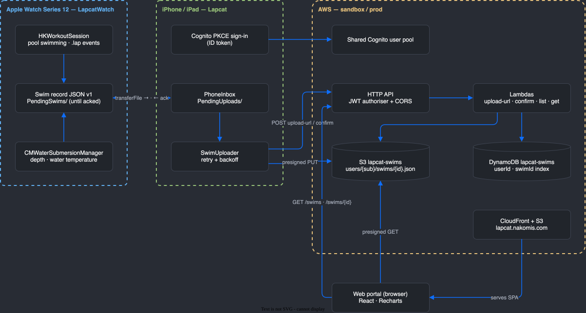

# Lapcat — Swim lap counter for Apple Watch, with an iPhone companion and AWS backend that record every detail of each swim


## Support

If you find this useful, please consider buying me a coffee:

[](https://www.paypal.com/donate?hosted_button_id=Q3BESC73EWVNN&custom=lapcat)

## Table of Contents

<!-- toc -->

- [What it does](#what-it-does)
- [Architecture Diagram](#architecture-diagram)
- [Repository Layout](#repository-layout)
- [Building](#building)
- [Architecture Diagrams](#architecture-diagrams)
- [Support](#support)

<!-- tocstop -->

## What it does

- **On the watch:** pick a pool length, start swimming, and Lapcat counts lengths automatically
  (HealthKit pool swim tracking) and shows a big lap count and elapsed time. Water Lock is on
  for the whole swim. At the end you get a summary, and the workout is saved to Apple Health.
- **Full swim record:** every lap's start and end, stroke style and count, heart rate, and water
  depth and temperature where the watch provides them, saved as versioned JSON.
- **Nothing is lost:** the record stays on the watch until the iPhone confirms the backend has it.
- **On the iPhone:** sign in (shared Cognito pool, multi-user), sync, and browse swim history.

## Architecture Diagram



```
Apple Watch ──WCSession.transferFile──▶ iPhone ──presigned PUT──▶ S3 (raw swim JSON)
                                          │
                                          └──HTTP API (Cognito JWT)──▶ Lambda ──▶ DynamoDB (swim index)
```

## Repository Layout

| Directory | Purpose |
|---|---|
| `apple/` | XcodeGen project: watchOS app, iPhone app, shared Swift code, tests, fastlane |
| `infra/` | CDK (TypeScript) — S3, DynamoDB, HTTP API, Lambdas, GitHub CI role |
| `docs/` | Logo, logo candidates, architecture diagrams |

## Building

```bash
# Apple apps
brew install xcodegen
cd apple && xcodegen generate && open Lapcat.xcodeproj

# Backend
cd infra && pnpm install && pnpm test
pnpm run deploy-sandbox
```

Distribution is TestFlight only.

## Architecture Diagrams

`docs/architecture/lapcat.drawio` is the source for the diagram above.
The SVG is auto-regenerated on commit by the pre-commit hook in `.githooks/pre-commit`.

To activate the hook after cloning:

```bash
git config core.hooksPath .githooks
```

## Support

If you find this useful, please consider buying me a coffee:

[](https://www.paypal.com/donate?hosted_button_id=Q3BESC73EWVNN&custom=lapcat)
